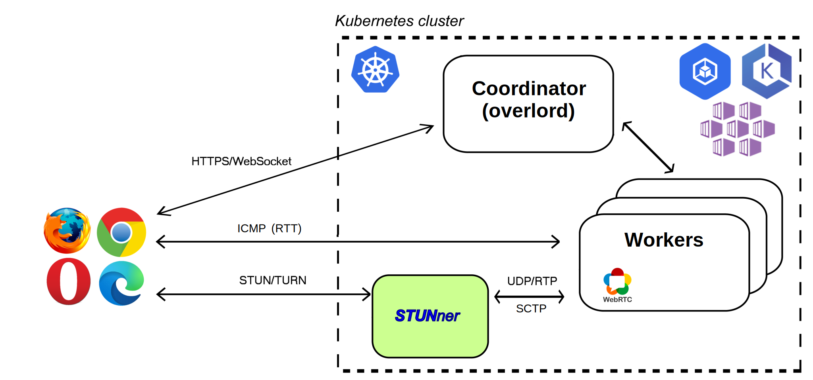

# STUNner & CloudRetro: Cloudgaming and their nasty UDP streams in Kubernetes

In this demo, we will install [CloudRetro](https://github.com/giongto35/cloud-game) on an existing Kubernetes cluster, and use STUNner to establish and redirect the UDP connection to its proper endpoint.

CloudRetro is a simplified cloud-gaming service using WebRTC for multimedia, thus with the need of UDP-forwarding, which can be a pain under RTP.
With STUNner, this issue can be solved.



The upcoming steps are the following:
* Install CloudRetro demo on your cluster
* Install and configure STUNner
* Configure CloudRetro to use STUNner

## Installation

### Prerequisities

* A functional Kubernetes cluster (autopilot works as well)
* kubectl
* Docker
* git
* helm

### Additional preparations

This demo provides some helpful scripts for the setup, so this repository should be cloned;

```console
git clone https://github.com/l7mp/stunner
cd stunner/examples/CloudRetro
```

### Quick-installing CLoudRetro

The included script sets up a demo CloudRetro service, with it's enviroment.
For a more-detailed setup and architecture-overview, please visit the [CloudRetro](https://github.com/giongto35/cloud-game) repository.

```console
kubectl apply -f cloudretro-setup.yaml
```

After it's complete, configuring and restarting the Worker deployment is needed, for that purpose a script is included:

```console
chmod +x apply-config-w.sh
./apply-config-w.sh
```

In the CloudRetro demo, we will be having multiple HTTPS web services, one linked to port 8000, and the other is to port 9000.
From this, port 8000 is essential, while without port 9000 which is neccessary for CloudRetro to work as intended, the demo should still work.

If everything is successful, Kubernetes should assign an external address to the exposed service of the Coordinator, which clients will connect to.
Running to following command will result the assigned address in a decimal four-octet format:

```console
# Cat is present because some terminals don't breakline  ^._.^
cat | kubectl get service -n cloudretro coordinator-lb-svc -o jsonpath='{.status.loadBalancer.ingress[0].ip}'
```

In cases Kubernetes won't assign an external IP to your service, You will need to use NodePort service instead.

Clients connecting to this URL on a browser; `hhtp://<service-ip>:8000` (don't forget to swap <service-ip> with the one mentioned above) will be presented a console-looking website, with seemingly no active additional service. The CloudRetro is running and working, but the endpoints can not establish an ICE connection. You can take a look at it in the console as well, this is because ICE can not create acceptable candidates through Kubernetes NATs, and not even a STUN server would help. RTP is unfit to handle this issue.
That's why we need STUNner to make it work.


### Installing STUNner


## Clean up

Delete the demo deployments and services created using the below command:

```console
kubectl delete -f cloudretro-setup.yaml
```

## Help

STUNner development is coordinated in Discord, send [us](/AUTHORS) an email to request invitation.

## License

Copyright 2021-2022 by its authors. Some rights reserved. See [AUTHORS](/AUTHORS).

MIT License - see [LICENSE](/LICENSE) for full text.

## Acknowledgments

Demo adopted from [CloudRetro](https://github.com/giongto35/cloud-game).


